# Diagramas de flujo — Productor-Consumidor

Diagramas Mermaid de los bucles principales del problema. Renderizan
nativamente en GitHub.

El monitor `Buffer` protege un ring buffer con un `std::mutex` y dos
variables de condición (`not_full`, `not_empty`). Las llamadas
`add` / `remove` esperan con predicado y notifican a su contrapartida.

## Productor

```mermaid
flowchart TD
    A([Inicio Producer]) --> B[Sembrar RNG con seed_]
    B --> C{i &lt; total_items_?}
    C -- no --> M[buffer.mark_done<br/>notify_all not_empty]
    M --> N([Fin Producer])
    C -- sí --> D[value = dist 1..20 rng]
    D --> E[buffer.add value]
    E --> F[Imprimir &#91;PROD&#93; iter value<br/>bajo cout_mtx]
    F --> G[sleep_for prod_sleep]
    G --> H[++i]
    H --> C

    subgraph add ["buffer.add(value)"]
        direction TB
        E1[Tomar lock m_] --> E2{count_ &lt; capacity_?}
        E2 -- no --> E3[wait not_full_<br/>libera lock]
        E3 --> E2
        E2 -- sí --> E4[data_&#91;rear_&#93; = value<br/>rear_ = rear_+1 mod cap<br/>++count_]
        E4 --> E5[notify_one not_empty_]
        E5 --> E6([Devuelve, libera lock])
    end
```

## Consumidor (genérico, id ∈ {1, 2, 3})

```mermaid
flowchart TD
    A([Inicio Consumer id]) --> B[iter = 0]
    B --> C[v = buffer.remove]
    C --> D{v tiene valor?}
    D -- no --> Z([Fin Consumer])
    D -- sí --> E[consumidos_.push_back v]
    E --> F{id == ?}
    F -- 1 --> G1[restar_y_calcular_moda<br/>vector_, v]
    F -- 2 --> G2[promediar_y_calcular_desviacion<br/>vector_, v]
    F -- 3 --> G3[sumatoria_por<br/>vector_, v]
    G1 --> H[Imprimir resultado + vector_<br/>bajo cout_mtx]
    G2 --> H
    G3 --> H
    H --> I[sleep_for cons_sleep]
    I --> J[++iter]
    J --> C

    subgraph remove ["buffer.remove()"]
        direction TB
        R1[Tomar lock m_] --> R2{count_ &gt; 0 o producer_done_?}
        R2 -- no --> R3[wait not_empty_<br/>libera lock]
        R3 --> R2
        R2 -- sí --> R4{count_ == 0?}
        R4 -- sí --> R5([Devuelve nullopt<br/>productor terminó])
        R4 -- no --> R6[value = data_&#91;front_&#93;<br/>front_ = front_+1 mod cap<br/>--count_]
        R6 --> R7[notify_one not_full_]
        R7 --> R8([Devuelve value])
    end
```

## Puntos de sincronización

| Punto | Espera en | Predicado | Notifica tras |
|---|---|---|---|
| `Buffer::add` | `not_full_` | `count_ < capacity_` | `not_empty_.notify_one()` |
| `Buffer::remove` | `not_empty_` | `count_ > 0 \|\| producer_done_` | `not_full_.notify_one()` |
| `Buffer::mark_done` | — | — | `not_empty_.notify_all()` (despierta a los 3 consumidores para que vean la terminación) |

**Terminación limpia.** Cuando el productor agota `total_items_` llama
a `mark_done()`, que activa `producer_done_` y despierta a los
consumidores bloqueados. Cada consumidor que encuentra el buffer
vacío con `producer_done_` recibe `nullopt` de `remove()` y sale del
bucle. No se usan centinelas en el flujo de datos.

**Exclusión mutua de la salida.** Los `std::cout` de los 4 hilos se
serializan con un `std::mutex` global `cout_mtx` (`Log.hpp`). Sin él
las líneas se entremezclan carácter a carácter.
